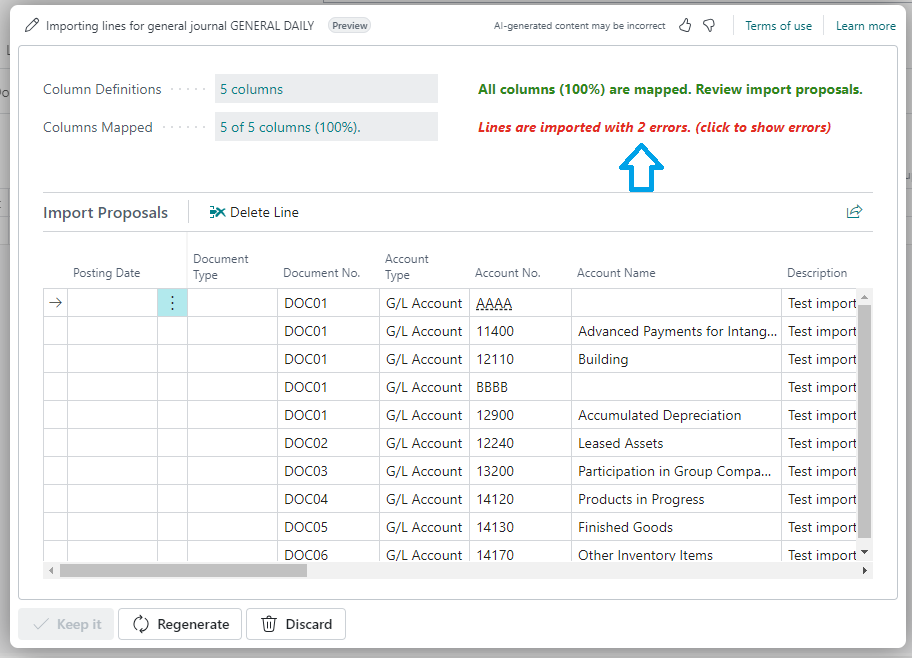

# Errors handling
&nbsp;  

In the event of data errors, the app provides detailed notifications, which are displayed directly on the Import Proposal page for your convenience.:
&nbsp;  
&nbsp;  

&nbsp;  
&nbsp; 

Clicking on the error notification opens a dedicated page with detailed information for better understanding:
&nbsp;  
&nbsp; 

