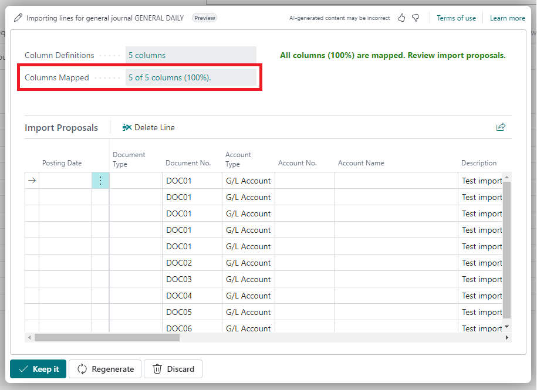
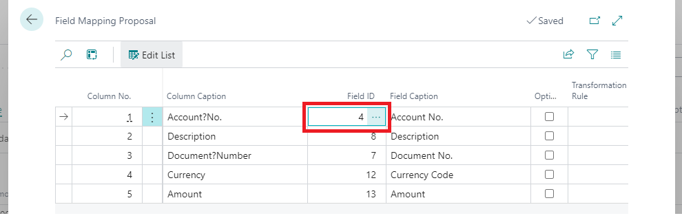
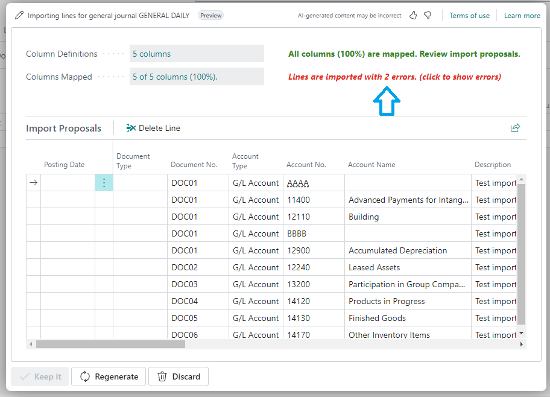
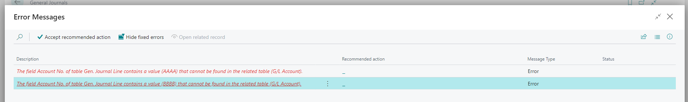

# **Getting Started with General journal**

&nbsp;

This app is ready to use immediately after installation — no setup required.

A new action called **Import with Copilot** is available on the General Journal page.

&nbsp;

## Step-by-Step: How to Import Excel Data

1. **Click Import with Copilot**  
   Locate this action in the ribbon of the journal or table where you want to import data.

2. **Select Your Excel File**  
   In the dialog that appears, click **Attach** or **Import Data from File**, then choose your Excel document.

3. **Review the Data Preview**  
   The app automatically detects and matches columns based on their names. You’ll see a preview of the records that will be imported.

4. **Confirm the Import**  
   Click **Keep it** to finalize the import. The data will be inserted into the journal or table immediately.

!!! warning "Important"
    The **order** of the columns **Account Type** and **Account No.** in your Excel file matters.  
    Make sure **Account Type** comes **before** **Account No.** to ensure correct field mapping and avoid errors.

&nbsp;

## Example Screenshots

1. **General Journal — Import with Copilot Action**  
   _This shows where the Import action is located in the General Journal._  
   
   
    &nbsp;

2. **AI Prompt for Import**  
   _The prompt used by the AI to help recognize and import your file._  
   
   
    &nbsp;

3. **Import File Dialog**  
   _Attach your Excel file or select it for import._  
   
   
     &nbsp;

4. **Data Preview Window**  
   _A preview of how the Excel data maps into the journal lines._  
   
   
    &nbsp;

5. **Journal After Import**  
   _Imported lines are added to the journal automatically._  
   
   
    &nbsp;

6. **Sample Excel File**  
   _An example Excel file with data ready for import._  
   [Download this Excel template to try it yourself →](Assets/sample-journal.xlsx)

---

&nbsp;
# **Regenerating the Import Proposal**

You can modify how Excel columns are mapped to journal fields before finalizing the import.

This is useful when the automatic matching isn't quite right, or when you want to customize which field receives the imported data.

&nbsp;

## Step-by-Step: How to Regenerate Column Mapping

1. **Click “Columns Mapped”**  
   After the app generates the initial mapping, select **Columns Mapped** to review the proposed field assignments.

2. **Choose a Different Destination Field**  
   Click on a mapped field you want to change, and select a different destination from the list.

3. **Click “Regenerate”**  
   After adjusting the mapping, click **Regenerate** to create a new import proposal based on your changes.

&nbsp;

## Example Screenshots

- **Mapped Columns Review**  
  _Displays how Excel columns were initially matched to journal fields._  
  

- **Select a Different Field**  
  _Choose the desired destination field from the list._  
  

&nbsp;

---

# **Error Handling**

If your import file contains errors, the app provides detailed notifications to help you understand and resolve the issues quickly.

These error messages appear directly on the **Import Proposal** page, so you can address them before continuing with the import.

## ⚠️ How Error Notifications Work

1. **Error Detected During Import**  
   If the data is invalid or incomplete, an error notification will be shown immediately on the proposal page.

2. **Click the Notification for Details**  
   Selecting the error message will open a detailed view, allowing you to review the exact issue and correct it as needed.

&nbsp;

## Example Screenshots

- **Import Error Notification**  
  _An error message is shown directly on the Import Proposal page._  
  

- **Detailed Error Explanation**  
  _Clicking the message opens a detailed error breakdown._  
  

✅ That’s it! Your data is imported and ready to post — no templates, no manual mapping, no stress.
