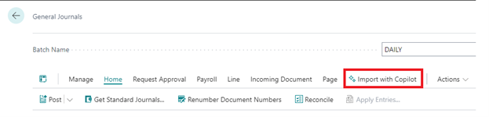
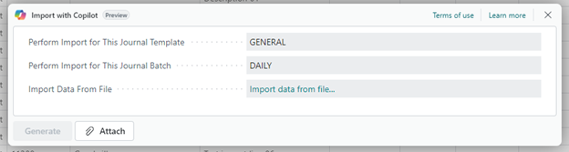
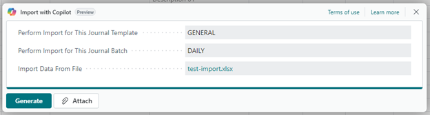
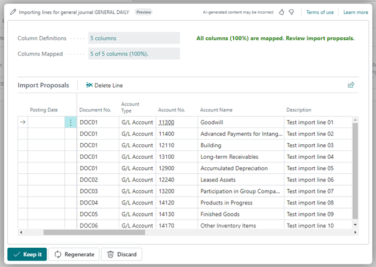
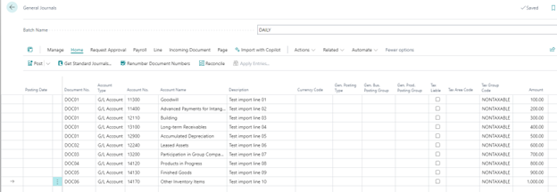
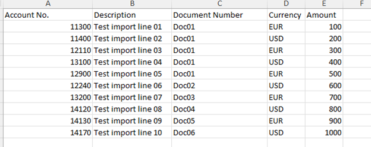

# How to use
&nbsp;  

The app is fully operational immediately upon installation, with no setup required. A new action, "Import with Copilot," will be added to the General Journal, as shown below:

  
&nbsp;  
&nbsp;  

After clicking on this action, a new dialog page will be shown:

  
&nbsp;  
&nbsp;  

Simply click 'Attach' or 'Import Data from File' and select the desired Excel file for seamless import:

  
&nbsp;  
&nbsp;  

The app will automatically perform the column matching and display a preview of the data for your review:

  
&nbsp;  
&nbsp;   

After clicking on Keep it, the lines will be imported into the journal:

  
&nbsp;  
&nbsp; 

The Excel file used in this example is structured as follows:

  
&nbsp;  
&nbsp;  